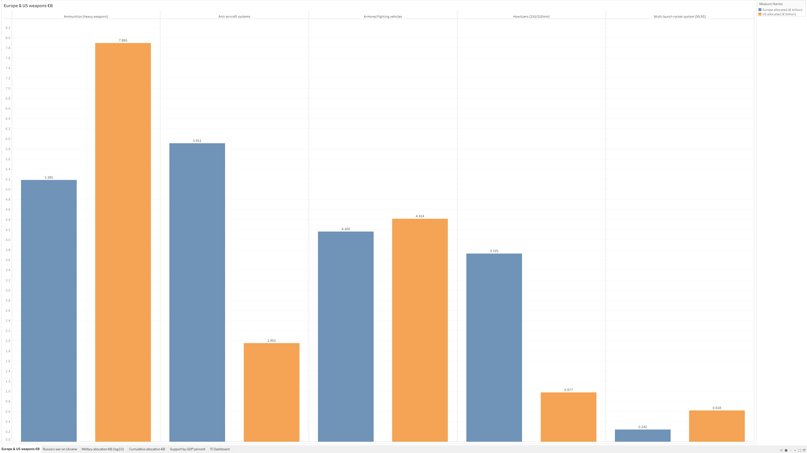
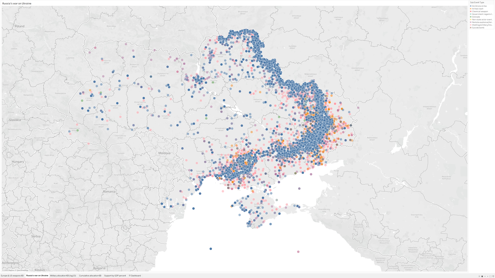
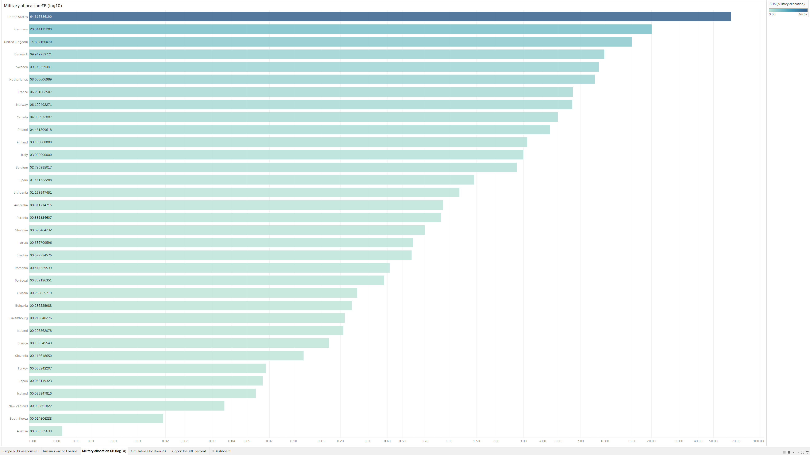
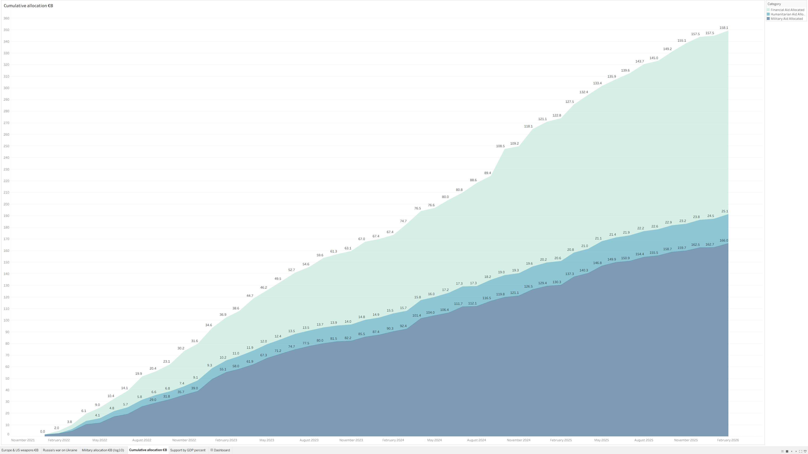
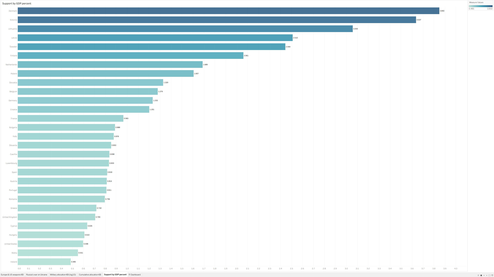

> [!NOTE]
>
> This repo contains data and files used in my final project for DCAS 5361.
>
> It is a core class in the [MS DCA](https://www.unt.edu/academics/programs/digital-communication-analytics-masters.html) program at University of North Texas.
>
> Narrated video: https://youtu.be/gstMXt2rHDo

# Ukraine by the numbers

Nathan Smith — DCAS 5361 — Spring 2026

## Overview

In February 2022, Vladimir Putin ordered the Russian invasion of Ukraine. It was dubbed a "special military operation" and by the Kremlin's account was only supposed to last about three days before an anticipated Ukrainian surrender (Wikipedia, 2022). Instead, Ukraine mounted a seemingly impossible defense with the aid of western allies.

In response to an offer to help him evacuate, Ukraine's president — who had a career in comedy prior to politics — bravely and humorously rebuffed the overtures of retreat with his now-famous quote.

> "I need ammunition, not a ride." — Volodymyr Zelenskyy

That is one thing I have admired about the Ukrainian people throughout this war. Even though they are up against overwhelming odds from a world superpower, they have retained their humanity and still hold their heads high. Another comedian made this joke when being interviewed by David Letterman.

> "Before the invasion, everyone said Russia had the second-best army in the world. Now we know they have the second-best army in Ukraine." — Anton Tymoshenko

By conventional logic, they should have lost by now. But instead, they are inventing their way out of trouble. Their drone program is now — out of necessity for survival — one of the premier warfighting technologies in the world (Myre, 2026). To the point where the United States is having to rely on Ukrainian expertise to defend against retaliatory drone strikes from Iran.

Ironically, both Russia and the United States are obligated by treaty (Budapest Memorandum, 1984) to defend Ukraine from any adversaries. Instead, we are fighting a proxy war against a tyrant who reneged on his nation's commitment to peace.

## Tableau data

For the purposes of this project I focused on five data sets, primarily sourced from the Kiel Institute for the World Economy as well as community-curated stats (Sangam, 2025). It is worth noting that since this conflict is taking place in Europe, most of the monetary information I found was specified in € billions of Euros.

### Europe & US weapons

This is a financial breakdown of the military aid provided by both European countries and the United States. It contains five subcategories.

- Ammunition (heavy weapons)
- Anti-aircraft systems
- Armored fighting vehicles
- Howitzers (155/152mm)
- Multi-launch rocket system (MLRS)

### Russia's war on Ukraine

Often, news reporting will focus on "the Ukraine conflict" or "the war in Ukraine." While not factually untrue, I think that tends to semantically shift the focus from the aggressor to the region being attacked. This entire ordeal is due to one man's ego. This map is an attempt to visualize Putin's appetite for violence. It has categorical color-coding for various battle events.

- Air or drone strike
- Armed clash (personnel)
- Chemical weapon
- Government (Ukraine) regains territory
- Grenade
- Non-state actors overtake territory
- Remote explosive, landmine, or IED
- Shelling, artillery, missile attack
- Suicide bomb

### Military allocation

This data set shows cumulative support for Ukraine from various countries, including Europe but also others such as South Korea and the United States. The bar graph is displayed logarithmically, so that tail-end countries with lower absolute support are still perceptible in the visualization.

### Cumulative allocation

This data set depicts cumulative support for Ukraine across all sources, shown categorically by three designations.

- Financial aid — €158 billion
- Humanitarian aid — €25 billion
- Military aid — €166 billion

### Support by GDP percent

This chart gives respect to countries that are earnestly supporting Ukraine but perhaps tend not to make headlines. It displays monetary values in percentage of each country's gross domestic product. For example, Denmark leads the way with 3.85% with Estonia close behind at 3.637%. Whereas the United States has contributed quite a bit objectively, that accounts for only 0.598% of GDP.

This is simply a statement of fact, not a value judgment. If anything, it shows how seriously some of these smaller countries take the threat of Russia. The general EU sentiment seems to be: If we do not band together and make a stand now, Putin will continue the rampage later. He will not stop his conquest voluntarily.

## References

- _Budapest Memorandum_. (January 14, 1984). Wikipedia. https://en.wikipedia.org/wiki/Budapest_Memorandum

- _I need ammunition, not a ride_. (February 24, 2022). Wikipedia. https://en.wikipedia.org/wiki/I_need_ammunition%2C_not_a_ride

- Kiel Institute for the World Economy. (April 16, 2026). _Ukraine Support Tracker_. Kiel Institute. https://kielinstitut.de/topics/war-against-ukraine/ukraine-support-tracker

- Myre, Greg. (March 9, 2026). _Why Ukraine is offering to help US in drone warfare with Iran_. NPR. https://www.npr.org/2026/03/09/nx-s1-5739401/why-ukraine-is-offering-to-help-u-s-in-drone-warfare-with-iran

- Palamarchuk, Marichka. (June 24, 2022). _Kyiv's therapeutic wartime craze – standup comedy_. Kyiv Post. https://www.kyivpost.com/post/7226

- Paudel, Sangam. (2025). _Ukraine Conflict Event Dataset (2022–2025)_ [Data set]. Kaggle. https://kaggle.com/datasets/sangampaudel530/ukraine-conflict-event-dataset-20222025/data

- _Timeline of the 2022 Russian invasion of Ukraine_. (February 24, 2022). Wikipedia. https://en.wikipedia.org/wiki/Timeline_of_the_2022_Russian_invasion_of_Ukraine
